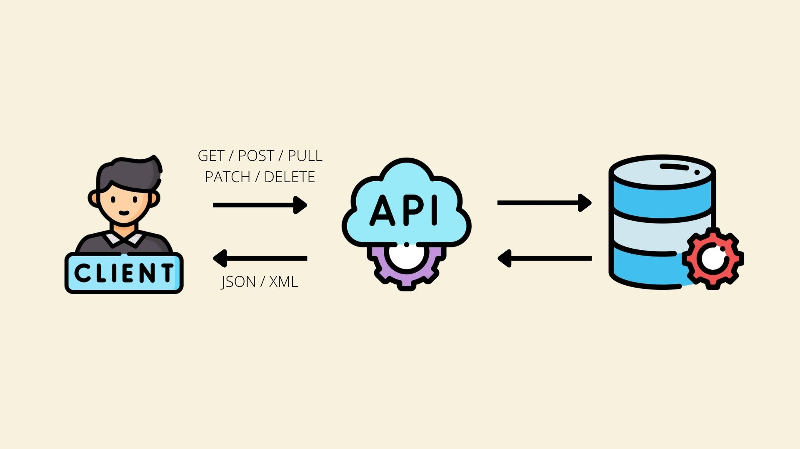
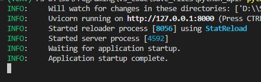
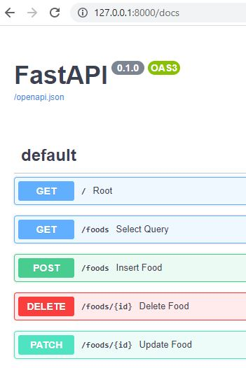

# Mini Project Fast API


สร้าง API ขึ้นมาสำหรับ รับ-ส่ง ข้อมูลเมนูอาหารกับ Database โดยสิ่งที่ต้องทำได้ คือ
1. ส่งข้อมูลอาหารเข้าไปเก็บใน Database (POST)
2. ดึงข้อมูลอาหารจาก Database (GET)
3. แก้ไขราคาอาหาร (PATCH)
4. ลบข้อมูลอาหาร (DELETE)

## Tools
- Python 3.9 (Library fastapi, uvicorn)

## Install Library
```
pip install -r requirements.txt
```

## Run Server โดยพิมพ์ Command ใน Terminal
```
python -m uvicorn foods:app --reload
```



## เข้าหน้าเว็บ เพื่อทดสอบ API
http://127.0.0.1:8000/docs


